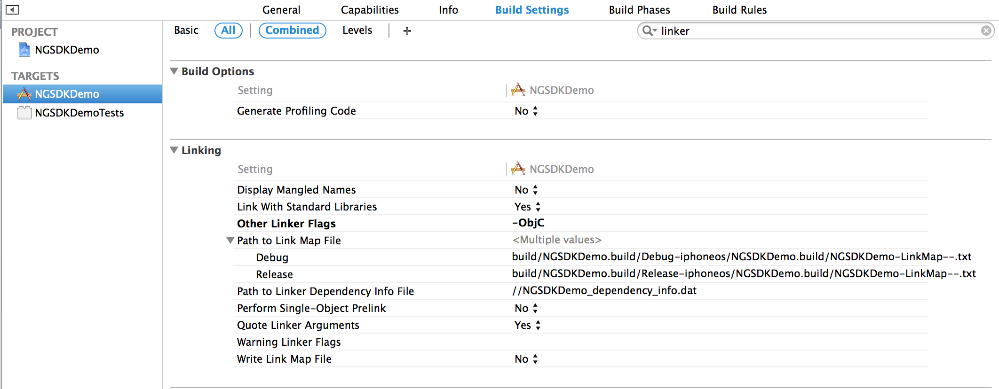
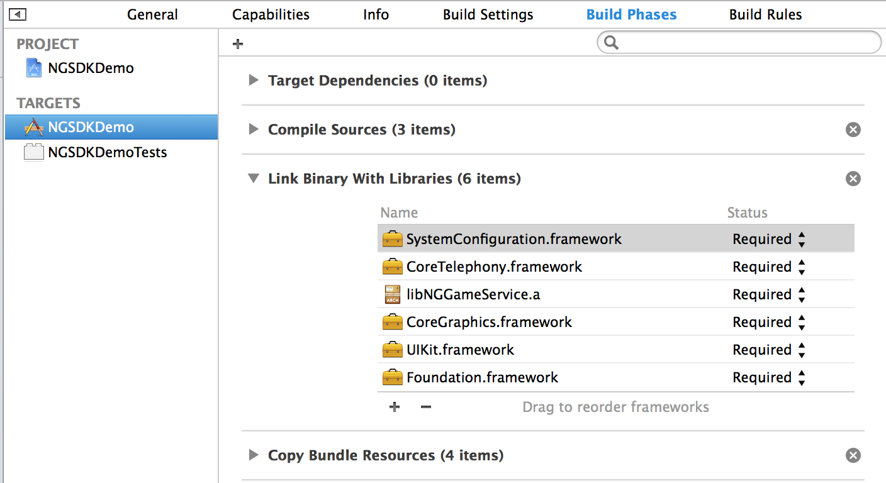
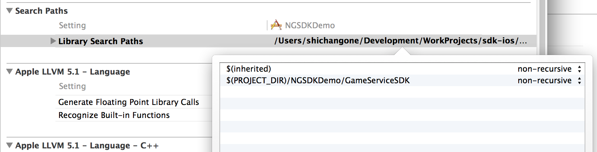

# GameService iOS SDK 说明文档 V1.0.2

<a href="../../static/download/GameService_iOS_SDK V1.0.2.zip" target="_blank" class="sdk-download">下载iOS SDK</a>

------

## 更新履历

版本号| 时间| 更新内容
----|-----|--------
v1.0.2|2014.08.07|修改登陆框消失问题，添加本地签名

## 1、SDK构成
1. 静态库 libGameServiceSDK.a, libGameService-arm64.a 
2. 头文件: NGGameService.h, NGNotifications.h, NGPaymentController.h
2. 资源文件 GameServiceResource.bundle
3. Demo工程

GameService SDK支持armv7、armv7s和arm64架构的iOS设备，iOS要求5.0以上，Xcode要求4.2以上，操作系统要求Mac OS X 10.7以上。

* 如果需要支持arm64，请使用静态库libGameServiceSDK-armv64.a

## 2、项目配置
### 2.1 添加链接参数
在工程target的"Build Settings"中，找到"Linking"的"Other Linker Flags"，添加参数`-ObjC`。

### 2.2 添加Framework
在工程target中添加以下的framework:

	SystemConEiguration.framework
	QuartzCore.framework
	Security.framework
	CoreTelephony.framework
	CoreText.framework

### 2.3 添加GameServiceSDK
1. 将GameServiceSDK文件夹拖入Xcode工程.
	
2. 在项目target的"build settings"中，找到"Search Paths"的"Library Search Paths", 如果GameServiceSDK的路径是绝对路径的，请改为相对路径。
	

## 3、GameService平台SDK使用
### 3.1 平台初始化
AppID和AppKey请到[GameService 开发网站](http://developers.gameservice.com/)后台查看获取，需要先创建App。

初始化需要设置AppID和AppKey：

	[NGGameService setAppID:@"9" AppSecret:@"0WiCxAU1jh76SbgaaFC7qIaBPm2zkyM1"];

设置App的URL Scheme，用于支付宝支付和微博SSO登陆,为保证URL Scheme的唯一，建议使用URL Scheme使用格式为: `NGGameService + (AppID)`:

	[NGGameService setAppURLScheme:@"NGGameService9"];

设置App屏幕方向(默认为横屏，不能同时横屏和竖屏切换):
	
	[NGGameService setOrientation:UIInterfaceOrientationMaskLandscape];

请在程序启动后设置初始化信息：

	- (BOOL)application:(UIApplication *)application didFinishLaunchingWithOptions:(NSDictionary *)launchOptions
	{
	    ......
	    
	    [NGGameService setClientID:@"9" clientSecret:@"0WiCxAU1jh76SbgaaFC7qIaBPm2zkyM1"];
	    [NGGameService setAppURLScheme:@"NGGameService9"];
	    [NGGameService setOrientation:UIInterfaceOrientationMaskLandscape];
	
		......
	}

### 3.2 账号
#### 3.2.1 登录
登录接口:

	[NGGameService login];
	
允许用户跳过登录界面的接口:

	[NGGameService loginWithAllowSkip];
	
说明:若当前用户已登录，调用登录接口会直接收到登录完成通知，不会显示登录界面。

#### 3.2.2 判断是否登录
	[NGGameService isLogin] 

#### 3.2.3 注销
	[NGGameService logout];
开发者注意调用注销后更新游戏场景。

#### 3.2.4 登录结果处理
用户进行登录操作并登录成功后，平台会发送登录成功通知`kNGLoginDidSuccessNotification`，开发者在收到通知后进行登录成功处理。

	[[NSNotificationCenter defaultCenter] addObserver:self selector:@selector(onUserLogin:) name:kNGLoginDidSuccessNotification object:nil];
	
处理方法:

	- (void)onUserLogin:(NSNotification*)n {
	    [self refreshLoginButton];
	    
	    if ([NGGameService isLogin]) {
	        NSString* userID = [NGGameService userID]; //获取userID
	        NSString* accessToken = [NGGameService accessToken]; //获取access token
	        
	        //验证accessToken
	    }
	}
	
登录成功后，可根据accessToken向服务器验证当前登录的有效性。

如果登录界面有跳过按钮，用户选择跳过,平台会发送跳过通知`kNGDidSkipLoginNotification`。

#### 3.2.5 获取已登录用户信息
	[NGGameService userID]; //获取userID
	[NGGameService accessToken]; //获取access token
	[NGGameService nickName]; //获取用户平台昵称

### 3.3 支付
支付相关类在`NGPaymentController.h`文件中。
#### 3.3.1 生成支付请求

填写订单信息:

    NGPaymentRequest* payment = [[NGPaymentRequest alloc] init];
    
    payment.appName = @"测试游戏";		//游戏名称
    payment.subject = @"测试商品名称";	//商品名称
    payment.body = @"测试商品描述";		//商品描述
    payment.amount = 100;					//价格（单位为“分”）
    payment.notifyURL = @""; 			//回调地址，
    payment.appID = @"9";					//应用ID
    payment.appUserID = @"123";			//应用当前登录用户ID
    payment.appOrderID = ;				//应用订单ID
    payment.appUserName = @"角色名";		//应用当前登录用户名
    
注：以上数据必填。
    
#### 3.3.2 交易签名
为防止交易请求被篡改，需要对订单的数据进行签名。提供两种签名方式：

##### 3.3.2.1 服务器签名，
**为保证资金安全，建议所有开发者使用服务器签名！！**

填充完订单请求后，获取待签名的字符串：

	NSString* stringToSing = [payment stringToSign];

客户端提交该字符串到开发者的服务器端进行签名，填充到`NGPaymentRequest`的`sign`字段。

	payment.sign = signiture; //signiture由开发者服务器返回

服务器端的签名配置见[Game Service服务端接入 说明文档](http://docs.gameservice.com/docs/sdk/server.html)。

##### 3.3.2.1 本地签名
**注意！！！本地签名存在一定的支付隐患，可能对你的游戏收入造成影响，只建议没有配备自有服务器的单机游戏使用。**

将NGPaymentRequest的usingLocalSigniture设置为YES.
	
	payment.usingLocalSigniture = YES;
    
#### 3.3.3 显示支付界面
使用支付请求初始化支付界面:

	 NGPaymentController* controller = [[NGPaymentController alloc] initWithPayment:payment];
    controller.paymentDelegate = self;
    [self presentViewController:controller animated:YES completion:nil];
    
#### 3.3.4 处理支付结果
实现NGPaymentControllerDelegate接口。

* 支付成功处理:

		- (void)paymentController:(NGPaymentController*)paymentController didSuccessWithResult:(NGPaymentResult*)result {
	    	NGPaymentRequest* request = paymentController.payment;
	    	NSString* orderID = result.orderID; //平台订单ID
	    	
	    	[self dismissViewControllerAnimated:YES completion:nil];
		}
	
支付完成后，开发者服务端通过平台订单id来确认订单完成。
	
* 取消支付

		- (void)paymentDidCancel:(NGPaymentController*)paymentController {
    		[self dismissViewControllerAnimated:YES completion:nil];
		}

#### 3.3.5 处理支付宝支付结果和微博SSO登录
在AppDelegate的`application:handleOpenURL:`和`application:openURL:sourceApplication:annotation:`中添加如下代码：

	- (BOOL)application:(UIApplication *)application handleOpenURL:(NSURL *)url {
    	return [NGGameService handleOpenURL:url];
	}
	
	- (BOOL)application:(UIApplication *)application openURL:(NSURL *)url sourceApplication:(NSString *)sourceApplication annotation:(id)annotation {
	    BOOL handled = [NGGameService handleOpenURL:url];
	    if (handled) {
	        return YES;
	    }
	    
	    //开发者添加自己的OpenURL处理
	    
	    return NO;
	}

### 3.4 数据采集

* 玩家用户登录行为记录（用于玩家行为统计以及进行玩家间p2p推送）：

		[NGGameService setLoginPlayerID:@"123456677"];

* 玩家用户付款行为统计：

		[NGGameService logPaymentWithPlayerID:@"123456677" payAmount:100];
	
### 3.5 推送设置
#### 3.5.1 配置推送证书(已经有p12证书的可以跳过这一步)

详见[APNS证书创建流程](http://docs.gameservice.com/docs/other/Create_APNG_Certificate.html)。

#### 3.5.2 上传推送证书到GameService

* 登录GameService开发者后台；
* 在**游戏管理**页面，在对应游戏的那一行上点击**编辑**按钮进入编辑界面；
* 点击**开发环境APNS证书**打开文件选择框，选择p12证书并上传；

#### 3.5.3 获取并上传device token
请求device token:

	[[UIApplication sharedApplication] registerForRemoteNotificationTypes:UIRemoteNotificationTypeBadge | UIRemoteNotificationTypeAlert | UIRemoteNotificationTypeSound];

在UIApplicationDelegate中获取device token，上传到GameService：
	
	- (void)application:(UIApplication *)application didRegisterForRemoteNotificationsWithDeviceToken:(NSData *)deviceToken {
    [NGGameService setPushToken:deviceToken]; //上传device token
	}

如果无法获取到到device token，请在`application:didFailToRegisterForRemoteNotificationsWithError:`中查看错误原因：

	- (void)application:(UIApplication *)application didFailToRegisterForRemoteNotificationsWithError:(NSError *)error {
    NSLog(@"%@", error);
	}

