# APNS证书创建流程

<!-- create time: 2014-08-01 13:33:00  -->

## 1 创建iOS App ID, 如果已经存在跳到步骤2
1 登录Apple Developer Center，选择Identifiers下的App IDs，点击添加:

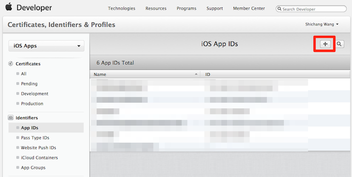

2 填写App ID Description:

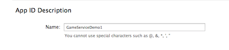

3 填写bundle ID:

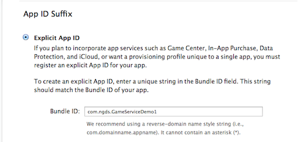

4 选中**Push Notification**, 点击继续:

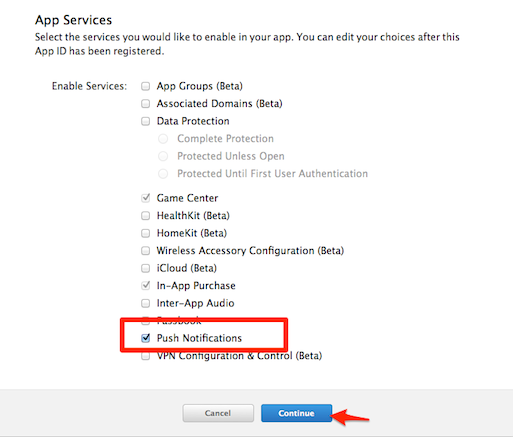

5 提交:

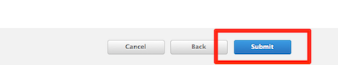

## 2 创建推送证书

这里以开发证书为例，发布证书步骤相同

6 打开Keychain， 点击菜单**"证书助理"** -> **"从证书颁发机构请求证书"...**:

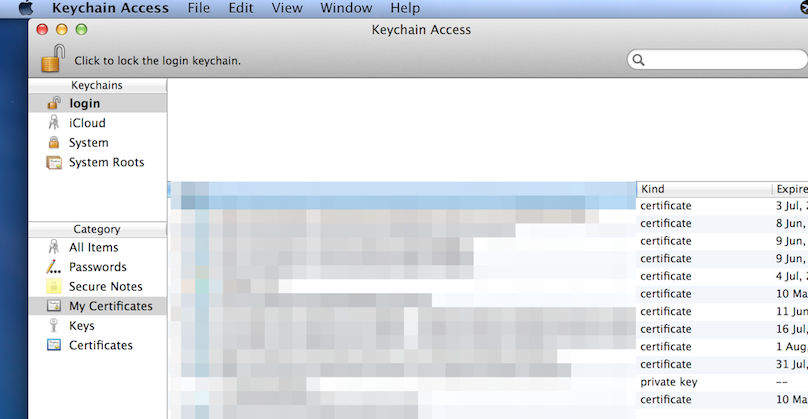
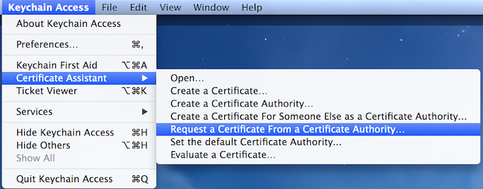

7 填写邮箱，常用名称，选择保存到磁盘，继续:

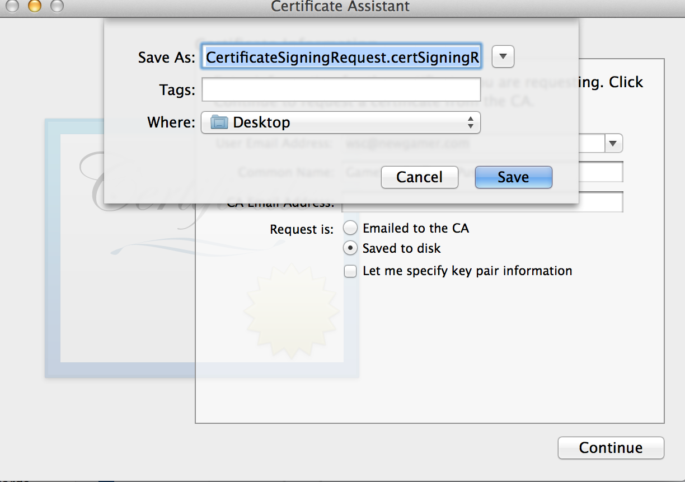

8 回到Apple Developer Center，在App ID列表上点击展开需要创建证书的App ID，点击**edit**

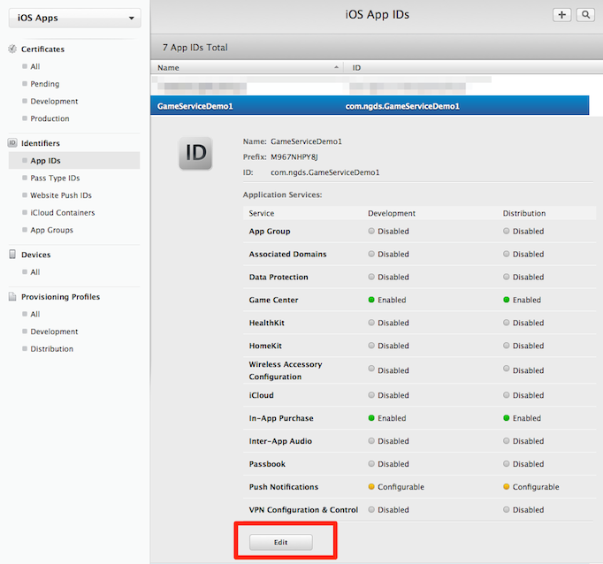

9 点击创建证书:

10 点continue继续:

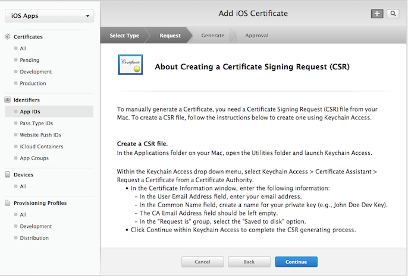

11 选择刚刚创建的certSigningRequest文件:

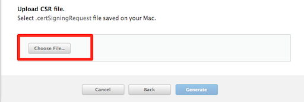

12 点击"Generate"生成:

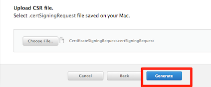

13 下载生成的证书，并双击安装:

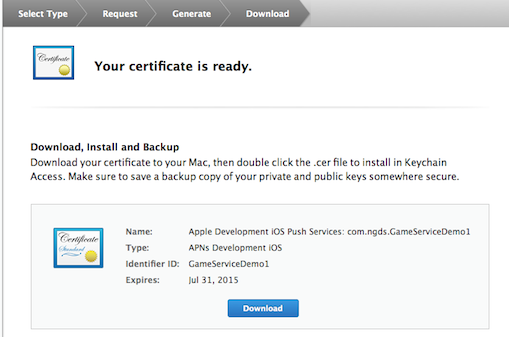

14 打开keychain，就可以看到生成的证书:

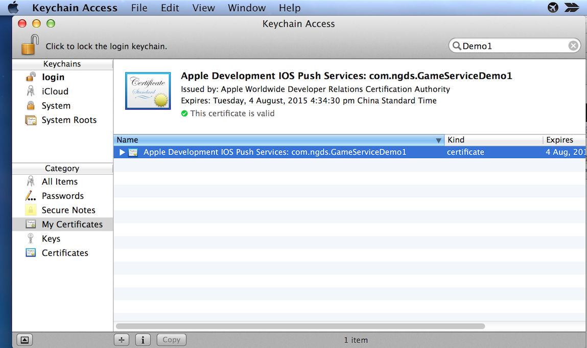

## 3 导出证书
15 在keychain中，点击安装好的证书，右键弹出菜单：

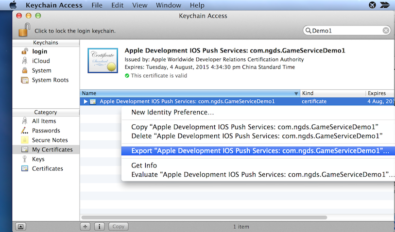

16 点击导出p12文件：

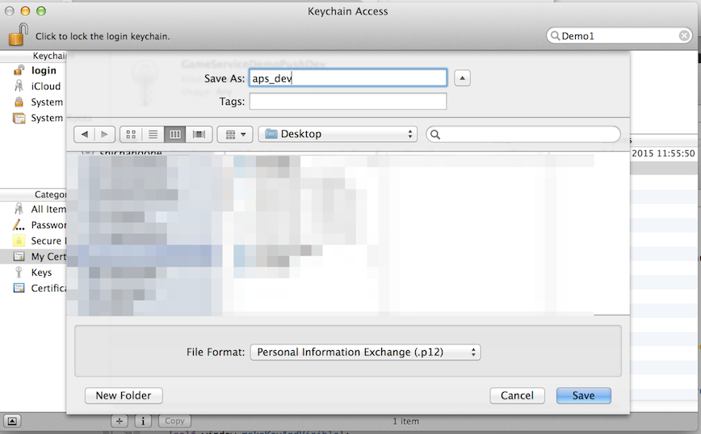

