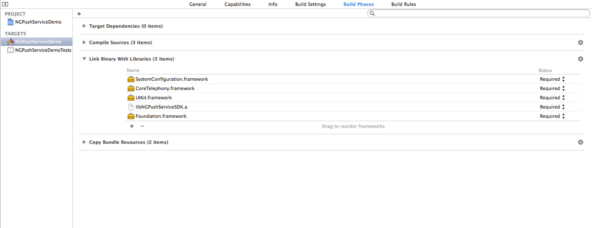
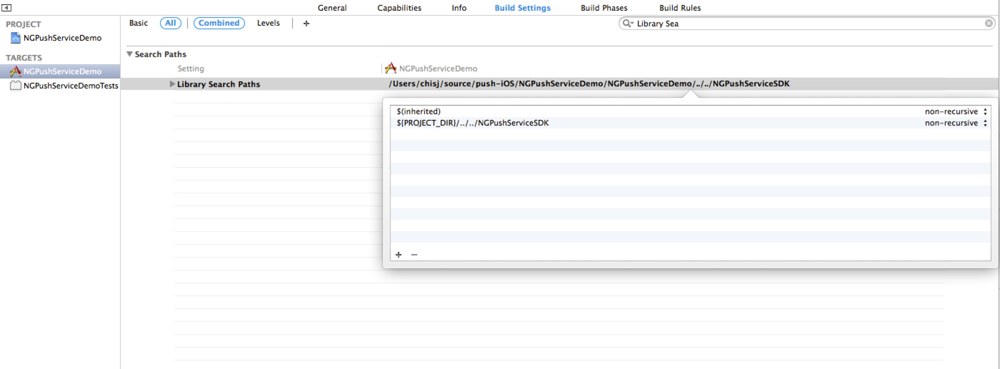

# NGPushService iOS SDK 说明文档 V1.0.0
<a href="../../static/download/NGPushService_iOS_SDK V1.0.0.zip" target="_blank" class="sdk-download">下载iOS SDK</a>

##更新履历
版本号| 时间| 更新内容
----|-----|--------
v1.0.0|2014.09.19|SDK正式版发布

## 1、SDK构成
1. 静态库 libNGPushServiceSDK.a, libNGPushServiceSDK-arm64.a
2. 头文件: NGPushService.h, NGPushServiceDefines.h
3. Demo工程

NGPushService SDK支持armv7、armv7s和arm64架构的iOS设备，iOS要求5.0以上，Xcode要求4.2以上，操作系统要求Mac OS X 10.7以上。

* 如果需要支持arm64，请使用静态库libNGPushServiceSDK-arm64.a

## 2、项目配置

### 2.1 添加链接参数
在工程target的"Build Settings"中，找到"Linking"的"Other Linker Flags"，添加参数`-ObjC`。

### 2.2 添加Framework
在工程target中添加以下的framework:

	SystemConfiguration.framework
	CoreTelephony.framework
	UIKit.framework

### 2.3 添加NGPushService
1. 将NGPushServiceSDK文件夹拖入Xcode工程.

2. 在项目target的"build settings"中，找到"Search Paths"的"Library Search Paths", 如果NGPushServiceSDK的路径是绝对路径的，请改为相对路径。
	
	
## 3、推送SDK使用

### 3.1 配置推送证书(已经有p12证书的可以跳过这一步)

详见[APNS证书创建流程](http://docs.gameservice.com/push/iOS/Create_APNG_Certificate.html)。

### 3.2 上传推送证书到GameService

* 登录GameService开发者后台；
* 在**游戏管理**页面，在对应游戏的那一行上点击**编辑**按钮进入编辑界面；
* 点击**开发环境APNS证书**打开文件选择框，选择p12证书并上传；

### 3.3 初始化SDK
AppID和AppKey请到[GameService 开发网站](http://developers.gameservice.com/)后台查看获取，需要先创建App。

初始化需要设置AppID和AppKey：

	[NGPushService setAppID:@"10057" AppSecret:@"n6tE8Nr0TRrxkxovOd4btirTyR8J3Ku6"];
	
### 3.4 获取并上传device token
请求device token:

	[[UIApplication sharedApplication] registerForRemoteNotificationTypes:UIRemoteNotificationTypeBadge | UIRemoteNotificationTypeAlert | UIRemoteNotificationTypeSound];

在UIApplicationDelegate中获取device token，上传到GameService：
	
	- (void)application:(UIApplication *)application didRegisterForRemoteNotificationsWithDeviceToken:(NSData *)deviceToken {
    	[NGPushService setPushToken:deviceToken]; //上传device token
	}

如果无法获取到到device token，请在`application:didFailToRegisterForRemoteNotificationsWithError:`中查看错误原因：

	- (void)application:(UIApplication *)application didFailToRegisterForRemoteNotificationsWithError:(NSError *)error {
    	NSLog(@"%@", error);
	}
	
## 4、统计SDK使用

### 4.1 设置登录玩家ID，在pushToken设置之后，玩家登录完成时调用此接口。如果开发的游戏不存在玩家ID，则设置为"0"

	[NGPushService setLoginPlayerID:@"123"];

* 注意，未正确设置pushToken则`setLoginPlayerID:`不可用。

### 4.2 设置渠道ID (可选)

	[NGPushService setChannelID:@"91_store" channelName:@"91手机助手"];

* 渠道ID命名可采用英文字母、数字和下划线的组合，例如"360", "91_store", "AppStore"等,在GameService网站中可以给渠道ID添加别名以方便查看

### 4.3 统计支付

	NGPaymentRecord *paymentRecord = [[NGPaymentRecord alloc] init];
	paymentRecord.player_id = @"123";
	paymentRecord.channel_id = @"91_store"; 	       //渠道ID
	paymentRecord.channel_name = @"91手机助手";          //渠道名
	paymentRecord.amount = 100;					       //充值金额，浮点型，精确到小数点后两位
	paymentRecord.payment_channel = @"alipay";       //支付渠道，自定义字符串
	paymentRecord.currency = @"人民币";               //金额币种，自定义字符串
	paymentRecord.coin_amount = 1000;                //充值的游戏币
	paymentRecord.order_id = @"201409190001";        //订单号，字符串，由游戏客户端定义。
	paymentRecord.level = 50;					      //玩家等级
	paymentRecord.server_id = @"AppStore_1";         //服务器ID
	paymentRecord.server_name = @"AppStore服务器1";   //服务器名
	[NGPushService pay:paymentRecord];
	[NGPushService pay:paymentRecord];

* 玩家等级为0-100的数字。
* 服务器ID命令采用英文字母、数字和下划线的组合，例如可以用"91Store_1"表示"91助手1号联运服务器""，"AppStore100"表示AppStore的100号服务器，服务器ID在GameService网站中可以添加别名，方便项目人员查看。

### 4.4 统计玩家进入某个等级，在玩家升级之后或者登录游戏(在`UIApplicationDidBecomeActiveNotification`消息处理函数中判断玩家是否登录，登录则调用)之后调用

	NGLevelRecord *levelRecord = [NGLevelRecord new];
	levelRecord.player_id = @"123";
	levelRecord.channel_id = @"91_store";            //渠道ID
	levelRecord.channel_name = @"91手机助手";         //渠道名
	levelRecord.server_id = @"AppStore_1";           //服务器ID
	levelRecord.server_name = @"AppStore服务器1";     //服务器名
	levelRecord.player_level = 50;                   //玩家等级，0-100的数字
	[NGPushService reachLevel:levelRecord];
	
### 4.5 统计玩家离开某个等级，在玩家升级之前和退出游戏之前调用(在`UIApplicationWillResignActiveNotification`消息处理函数中判断玩家是否有等级，有等级则调用)

	NGLevelRecord *levelRecord = [NGLevelRecord new];
	levelRecord.player_id = @"123";
	levelRecord.channel_id = @"91_store";               //渠道ID
	levelRecord.channel_name = @"91手机助手";            //渠道名
	levelRecord.server_id = @"AppStore_1";
	levelRecord.server_name = @"AppStore服务器1";        //服务器名
	levelRecord.player_level = 50;
	[NGPushService leaveLevel:levelRecord];

* reachLevel:和leaveLevel:配合使用，统计玩家在某个等级的在线时间。
	
### 4.6 统计玩家进入关卡

	NGMissionRecord *missionRecord = [NGMissionRecord new];
	missionRecord.player_id = @"123";
	missionRecord.channel_id = @"91_store";             //渠道ID
	missionRecord.channel_name = @"91手机助手";          //渠道名
	missionRecord.server_id = @"AppStore_1";
	missionRecord.server_name = @"AppStore服务器1";      //服务器名
	missionRecord.mission_id = @"100001";               //关卡id
	missionRecord.mission_name = @"第一关：新手村";        //关卡名
	[NGPushService enterMission:missionRecord];
	
* 关卡ID用"100001"到"199999"之间的字符串表示，"100001"表示第1关，依次增加。在GameService网站中可以给关卡添加别名，比如"100001"别名为"第一关"，"100001"别名为“第二关”。
	
### 4.7 统计玩家离开关卡，在玩家离开关卡或者退出游戏时调用
	
	NGMissionRecord *missionRecord = [NGMissionRecord new];
	missionRecord.player_id = @"123";
	missionRecord.channel_id = @"91_store";             //渠道ID
	missionRecord.channel_name = @"91手机助手";          //渠道名
	missionRecord.server_id = @"AppStore_1";
	missionRecord.server_name = @"AppStore服务器1";      //服务器名
	missionRecord.mission_id = @"100001";
	missionRecord.mission_name = @"第一关：新手村";        //关卡名
	[NGPushService leaveMission:missionRecord];
	
### 4.8 统计玩家消费行为

	NGConsumptionRecord *consumptionRecord = [NGConsumptionRecord new];
	consumptionRecord.player_id = @"123";
	consumptionRecord.channel_id = @"91_store";             //渠道ID
	consumptionRecord.channel_name = @"91手机助手";          //渠道名
	consumptionRecord.server_id = @"AppStore_1";
	consumptionRecord.server_name = @"AppStore服务器1";      //服务器名
	consumptionRecord.item_id = @"11";                      //消费的商品ID
	consumptionRecord.item_name = @"钻石60个";               //消费的商品名称
	consumptionRecord.item_amount = 1;                      //消费商品数量
	consumptionRecord.coin_amount = 100;                    //话费虚拟币
	[NGPushService consumption:consumptionRecord];
	
### 4.9 统计玩家剩余虚拟币

	NGCoinRecord *coinRecord = [NGCoinRecord new];
	coinRecord.player_id = @"123";
	coinRecord.channel_id = @"91_store";                    //渠道ID
	coinRecord.channel_name = @"91手机助手";                 //渠道名
	coinRecord.server_id = @"AppStore_1";
	coinRecord.server_name = @"AppStore服务器1";             //服务器名
	coinRecord.coin_amount = 90000;                         //剩余虚拟币
	[NGPushService coin:coinRecord];